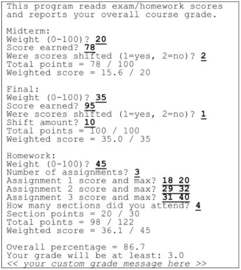

# pro192x_2.1-a_vn-java-oop-basics-gradestudent

 This folder contains my submission to the assignment `Grade Student` in the course PRO192x_2.1-A_VN (Object-Oriented Programming with Java), a part of the path Software Engineering provided by FUNiX.

## About the project

- The project simulates a simple program to get grades from user to calculate final grade. And to fulfill this, the project covers Java basics and OOP (the UI is just simple print-outs on console): expressions with variables of different types in Java, printing out in console, loops in Java, Scanner.in to get user input, handle with value-return methods.

- **Keyword**: _Java basics, collections, object-oriented programming, OOP_.

## Functional description

<a href="PRO192x_Project 2_phupaFX07929@funix.edu.vn">_**Grade Student**_</a>  has some following features:

- First, print out introduction of the program: **_“This program reads exam/homework scores and reports your overall course grade"_**
- Input _**Midterm Grade**_, including:
  - **Weight (0-100)**: the percentage of midterm grade out of total max points
  - **Score earned**: the actual point which user gets
  - **Were scores shifted (1 = yes, 2=no)**: whether or not extra points are added into the total actual point. If yes, **Shifted amount** will be keyed in; otherwise, move to printing out
  - Print out in console: **Total points** (=Score earned + Shifted amount (if any)) and **Weighted amount** (= Score earned * Weight / 100)
- Input **Final Grade**, including components similar to **Midterm**
- Input _**Homework**_, including:
  - **Weight**: similar to the one of Midterm
  - **Number of assignments**: declare the number of assignments. Based on the number keyed in, user must input 2 number for **Assignment x score and max** corresponding to the actual points and maximum score for the assignment (x - the order number of the assignment)
  - **How many sections did you attend?** : input a number indicating the attendance of user in classes
  - Print out in console: **Section points** (=Number of sections * 5, max: 30), **Total points** (= sum of actual points of assignments), **Weighted score** (= sum of actual points/ sum of max score * Weight)

- Display the final score with:
  - **Overall percentage** (=sum of Weighted scores from Midterm, Final and Homework)
  - **Your grade will be at least**: convert to scale 0-3 based on Overall percentage and the rule

  | GPA=3.0    | GPA=2.0     |GPA=1.0     |GPA=0.0     |
  | :------------- | :------------- | :------------- |:------------- |
  | Overall percentage >= 85%     | Overall percentage >= 75% and < 85%       |Overall percentage >= 60% and < 75%       |Overall percentage < 60%       |

  - Custom message to user based on GPA

## Demo

## Further enhancement
- Add UI with JavaFX or Java Swing for better user interaction.
